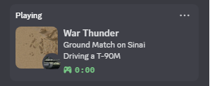
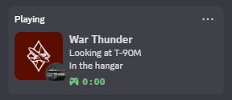
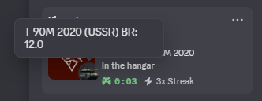

# War Thunder Discord Rich Presence

## Credits and Shoutout

A huge shoutout to [ValerieOSD](https://github.com/ValerieOSD/WarThunderRPC) for their foundational work on War Thunder RPC scripts, which served as the inspiration and starting point for this project. Their efforts made this possible\!

**This project was developed with the assistance of Gemini, an AI assistant.**

This Python script integrates with War Thunder's in-game telemetry API to update your Discord Rich Presence, displaying your current activity in the game, including the vehicle you're using, the map, and its Battle Rating (BR).

## **Features**

* **Dynamic Status:** Automatically updates your Discord status when you're in the hangar, in a match, or in a test drive.  
* **Vehicle Information:** Displays the vehicle you are currently viewing or playing, with its correct in-game name (scraped from War Thunder Wiki).  
* **Map Recognition:** Identifies the current map you are playing on and displays it.  
* **Battle Rating (BR):** Fetches and displays the Battle Rating of your current vehicle.  
* **Game State Detection:** Distinguishes between hangar, in-match, and test drive states.  
* **Robustness:** Includes error handling for API connectivity issues and unrecognized map data.

## **Visuals**

Here are some screenshots of the Discord Rich Presence in action:

| Screenshot 1 | Screenshot 2 | Screenshot 3 |
| :---- | :---- | :---- |
|   |  |  |
| *Caption for Screenshot 1: Discord Rich Presence displaying in-game status, showing the map (Sinai) and the vehicle (T-90M).* | *Caption for Screenshot 2: Discord Rich Presence displaying hangar status, showing the vehicle (T-90M\) being viewed.* | *Caption for Screenshot 3: A detailed view of the Discord Rich Presence, showing the vehicle's full name, country, and Battle Rating (BR).* |

**Note on Map Display:** For map images to appear in your Discord Rich Presence, you need to upload them as "Art Assets" to your Discord Application in the [Discord Developer Portal](https://discord.com/developers/applications) (under Rich Presence \> Art Assets). The script expects these assets to be named according to the map's lowercased, underscore-separated name (e.g., sinai, golan\_heights). Please be aware that it can take some time for newly uploaded assets to propagate and become visible in your Rich Presence.

## **Prerequisites**

Before running the script, ensure you have the following installed:

* **Python 3.x:** Download from [python.org](https://www.python.org/downloads/).  
* **Required Python Libraries:**  
  pip install pypresence requests Pillow imagehash

* **War Thunder:** The game must be running for the script to fetch telemetry data.  
* **War Thunder's Local API Enabled:** Ensure War Thunder's local API is accessible. This is usually enabled by default when the game is running. The script connects to http://127.0.0.1:8111.

## **Installation**

1. **Clone the repository (or download the files):**  
   git clone https://github.com/ajaniceman/WarThunderRPC.git  
   cd WarThunderRPC

2. **Place the script files:** Ensure main.py, telemetry.py, mapinfo.py, and maps.py are all in the same directory.  
3. **Create mapPictures directory:** In the same directory as the scripts, create an empty folder named mapPictures. This folder will store downloaded map images.

## **Running the Script**

To run the script, simply execute main.py using Python:

python main.py

Keep this script running in the background while you play War Thunder. You can close the console window or terminate the script when you are finished playing.

## **Configuration**

* **Discord Client ID:** The CLIENT\_ID is hardcoded in main.py. If you wish to use a different Discord Application for Rich Presence, you can change the CLIENT\_ID variable at the top of main.py:  
  CLIENT\_ID \= "YOUR\_DISCORD\_APPLICATION\_CLIENT\_ID\_HERE" 

  **Important:** You **must** replace "YOUR\_DISCORD\_APPLICATION\_CLIENT\_ID\_HERE" with your own unique Application ID obtained from the Discord Developer Portal. This is crucial for the Rich Presence to function correctly for your Discord account.  
  You can create and manage Discord applications at the [Discord Developer Portal](https://discord.com/developers/applications).

## **Troubleshooting**

* **"War Thunder is not running"**: Ensure War Thunder is actively running.  
* **"Could not connect to map JSON API" / "Map JSON data malformed or empty"**: This can happen if War Thunder is in the hangar or a loading screen. If it persists during a match, ensure your firewall isn't blocking Python's access to localhost:8111.  
* **"Map image not recognized"**: The script uses perceptual hashing to identify maps. If a new map is added to War Thunder or an existing map's image changes significantly, its hash might not be in maps.py. You may need to manually add new map hashes to maps.py.  
* **Incorrect Vehicle Names / BRs**: The script attempts to scrape vehicle names and BRs from the War Thunder Wiki. If the wiki's HTML structure changes, or if a vehicle page has an unusual format, the scraping might fail or produce incorrect results.  
* **ValueError: invalid literal for int() with base 16: ''**: This error indicates an empty string in the hashes list within your maps.py file. Ensure all hash entries are valid hexadecimal strings or the list is empty (\[\]).